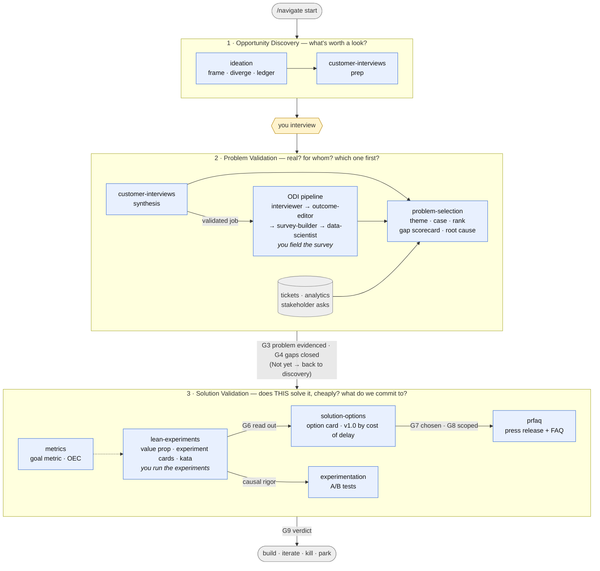

# ProductExpert

A system of expert subagents for product managers. Each agent distills a body
of training and materials — books, courses, frameworks — into a practical
helper for one specific PM job to be done. The agents compose: outputs of one
are gated inputs of the next.

**Documentation:**
[Principles](docs/principles.md) ·
[How the system works](docs/how-it-works.md) ·
[User guide](docs/user-guide.md) ·
[Interaction model](docs/interaction-model.md) ·
[Credits](CREDITS.md)

**Start here:** `/navigate start` — it asks what you have in hand, creates
`initiatives/<slug>/`, and routes you to the first agent. `/navigate
status` tells you where an initiative stands; `/navigate next` who's up.

## How it's organized

- **`.claude/agents/<name>.md`** — the agents: role, process, guardrails.
  This is *behavior*.
- **`methods/<topic>/`** — the *knowledge* the agents draw on: distilled
  method docs and templates, plus raw third-party materials under
  `materials/`. One topic has no agent of its own and every agent reads
  it: [`methods/strategy/product-strategy.md`](methods/strategy/product-strategy.md)
  — strategy as a deployable framework (Bungay, via Perri), the three
  strategic gaps, the four levels (vision → strategic intents → product
  initiatives → options), and the **Product Kata** as the loop at every
  level: *understand the direction · analyze the current state · set
  the next goal · execute or deploy*, with Rother's Improvement Kata and
  Coaching Kata (the five questions, and the reflection on the back of
  the card) preserved as its source.
- **`.claude/skills/navigate/`** — the front door: `/navigate start |
  status | next | list`. Reads an initiative's folder, derives the gates
  from the artifacts, routes to the right agent.
- **`.claude/skills/evaluate/`** and **`evals/`** — the evaluation suite:
  `/evaluate routing | gates | output | all` against 27 routing cases,
  three gate fixtures and an output rubric; runs logged in
  `evals/runs.md`.
- **`templates/initiative/`** — the scaffold `/navigate start` copies:
  `STATUS.md` (phase · gates · log) and `ledger.md` (the one assumption
  ledger).
- **`initiatives/<slug>/`** — *your* work, one folder per initiative;
  every agent reads and writes there. Not part of the toolkit; commit it
  or ignore it as you prefer.
- **`docs/`** — principles, architecture, usage, and the interaction
  model.

> Agents = behavior. `methods/` = knowledge. Keeping them separate means you
> can sharpen an agent by improving its method doc or dropping in new
> materials, without touching how it behaves. Knowledge shared by several
> agents is written exactly once.

## The three phases

A good product process runs **Opportunity Discovery → Problem Validation
→ Solution Validation**, and each agent belongs to one of them. The
recurring failure is hearing what users ask for, building exactly that,
and learning it wasn't what they wanted — which is why the third phase
exists and runs *before* engineering, not after.

| Phase | The question | Agents |
|-------|--------------|--------|
| **1 · Opportunity Discovery** | What's out there, and what's worth a look? | `ideation`, `customer-interviews` (prep), `odi-interviewer` |
| **2 · Problem Validation** | Is the problem real, for whom, how much, and which one first — and what don't we know yet? | `customer-interviews` (synthesis), `odi-outcome-editor` → `odi-survey-builder` → `odi-data-scientist`, `problem-selection` (verdict + knowledge-gap scorecard + root cause) |
| **3 · Solution Validation** | Does *this* solution solve it — proven cheaply, before we build — and what exactly do we commit to? | `lean-experiments` (concept · concierge · Wizard of Oz · prototypes · API access · MLP · kata), `solution-options` (option cards · v1.0 by cost of delay), `prfaq`, `experimentation`, `metrics` |

## The two tracks

**Track 1 — Qualitative discovery** answers *"is the problem real, and do we
understand it?"* **Track 2 — the ODI pipeline** answers *"which customer
needs should we prioritize, for whom, with what strategy?"* The bridge: a
validated, solution-agnostic job from Track 1 is the market definition that
starts Track 2.

Solid arrows are hand-offs; dotted ones are inputs. Yellow hexagons and
italics are the steps that stay yours. The loops the diagram leaves out:
a *Not yet* from problem-selection sends the initiative back to
discovery for the missing evidence; a failed experiment goes back to the
option or the problem; and every agent's verdict is appended to the
initiative's `STATUS.md`, which `/navigate status` reads to derive the
gates (G1–G10, in [`docs/interaction-model.md`](docs/interaction-model.md)).

Between discovery and the documents sits a **selection gate**:
**`problem-selection`** takes the competing problems both tracks (and
tickets, analytics, stakeholders) throw up, themes them with affinity
mapping, builds an evidence case per problem, and ranks them on Customer
Signal × Business Alignment with a *Yes / Not yet / Probably not* verdict.

Around both tracks sits a **solution-validation layer**:
**`lean-experiments`** proves a proposed solution cheaply before anything
is built (concept test, concierge, Wizard of Oz, minimum lovable product,
Product Kata cycles) and writes the value proposition it tests;
**`prfaq`** turns validated opportunity into a written product vision (and
its "what we'd need to believe" list); **`experimentation`** turns the
riskiest beliefs a live product can carry into trustworthy A/B tests; and
**`metrics`** defines the North Star tree, goal metrics, OECs, and
guardrails the other three depend on.

## Agents

### Ideation — `ideation`
Front-door thinking partner for the fuzzy front end — before interviews or
documents are justified. Four modes (problem exploration, solution
ideation, assumption testing, strategy exploration), a
frame→diverge→provoke→converge→capture rhythm, a BACKGROUND-tagged
landscape scan, and a gated output: the shared assumption ledger naming
the riskiest assumption and its cheapest test, plus a routing call
(interview / quantify / PR-FAQ / park / kill). Distilled from Anthropic's
`product-brainstorming` plugin skill.
Method: [`methods/ideation/brainstorming.md`](methods/ideation/brainstorming.md)

### Customer Interviews — `customer-interviews`
Preps and synthesizes open-ended discovery interviews. Grounded in *Talking
to Humans* (Constable & Rimalovski), Steve Blank's Customer Development, and
the Fluxx research-and-insight principles.
**Prep:** learning goal → ranked assumptions → segments + screener →
non-leading guide → recruiting → debrief template. **Synthesis:**
observations vs. interpretations → patterns → insights → assumption
scorecard → persevere/pivot/dig-deeper + next experiment.
Method: [`methods/customer-interviews/`](methods/customer-interviews/)

### ODI Interviewer — `odi-interviewer`
Phase 1 (Discover) of Tony Ulwick's Outcome-Driven Innovation. Defines the
market around a job, builds the 8-step job map, preps structured guides
(including multi-call partner/ISV discovery with dual-job framing and
developer question banks), and extracts desired outcome statements from
transcripts. Method: [`methods/odi/interviewing.md`](methods/odi/interviewing.md)

### ODI Outcome Editor — `odi-outcome-editor`
Phase 1.5 (Curate): the quality gate. Validates statement structure,
deduplicates, normalizes abstraction, audits solution-agnosticism, checks
job-map coverage — and sends targeted interview requests upstream when steps
are undercovered. Method: [`methods/odi/outcome-statements.md`](methods/odi/outcome-statements.md)

### ODI Survey Builder — `odi-survey-builder`
Phase 2 (Quantify): turns the curated statements into an importance ×
satisfaction survey instrument with screener, randomization plan, fielding
specs (180–600 respondents), and data dictionary. You field it.
Method: [`methods/odi/survey-design.md`](methods/odi/survey-design.md)

### ODI Data Scientist — `odi-data-scientist`
Phase 3 (Analyze & Act): opportunity scores
(`Importance + max(Importance − Satisfaction, 0)`), the opportunity
landscape, needs-based segmentation (factor + cluster, statistically gated),
segment profiles, and a growth-strategy recommendation — computed with real,
saved Python. Method: [`methods/odi/opportunity-analysis.md`](methods/odi/opportunity-analysis.md)

### Problem Selection — `problem-selection`
Decides **which problem to work on** when several compete. Themes raw
input (tickets, feedback, transcripts, stakeholder asks) with **affinity
mapping** (K-J method, ASQ) — group before naming, count distinct sources
— then builds a four-step case per candidate: job-story problem statement
→ evidence table (qualitative / quantitative / operational, confidence
1–5) → patterns (convergence, conflicts, gaps) → verdict *Yes / Not yet /
Probably not*. Ranks the *Yes* verdicts on **Customer Signal × Business
Alignment**, read differently for retention, acquisition, and
internal-tool goals; *Not yet* becomes a learn list with the missing
evidence named. Ranks problems — not solutions (`ideation`), not outcomes
within a job (ODI). Then closes Problem Validation with the **knowledge-gap
scorecard** (Product Institute): confidence 1–5 in problem definition,
user behavior, competitive landscape, technical constraints and business
impact, evidence-cited; the lowest area picks the move — customer
interviews, **root-cause problem analysis** (5 Whys, fishbone,
interrelationship digraph, run here), competitive teardown (`ideation`),
a feasibility spike, or sizing — and no area below 3 is the exit gate
into solution exploration.
Methods: [`methods/problem-selection/`](methods/problem-selection/)

### Lean Experiments — `lean-experiments`
Proves a solution is worth building **before building it**. Starts from
one sentence — *what are we trying to prove right now?* — then picks and
designs the cheapest test that could say no: **concept test** (Bank of
America's cartoon video + 1,600-person survey), **landing page / smoke
test**, **concierge** (generative: deliver by hand, visibly, to find the
solution), **Wizard of Oz** (evaluative: simulate the product, humans
behind the curtain), **minimum lovable product** with a manual back-end
and an automation vision (Gusto), or **minimum viable investment** steps
for an existing product (Matts). Every experiment card carries *Expected*
and *Would disprove* written before the run. Runs the **Product Kata**
(Perri, from Toyota Kata) as the rhythm for an initiative: direction →
current condition → obstacle → small step → learned → re-measure. Also
writes **value propositions** — functional + emotional jobs → "We [deliver
outcome] by [solving key job]" — on the Strategyzer canvas. When the
input is a **feature request**, it doesn't build it — it breaks it down:
the observation behind it, the **eight assumption questions** (problem
for us · audience · opportunity · alternatives · constraints ·
go-to-market · KPIs · critical success factors), the assumption chain,
the one **riskiest assumption**, and its cheapest test; a null result is
checked for reach before it is read as "no demand." In kata mode the
direction is the **direction ladder** from the strategy method (which
intent, which initiative, signed by the level above) and an unstated
direction is the first obstacle, never invented. Treats the **MVP**
as the fastest path to insight, never a small v1: no learning goal, no
MVP; scoped backwards from the one thing to learn and the one measure
(adoption · retention · conversion · satisfaction). Not A/B tests
(`experimentation`), not problem validation.
Methods: [`methods/lean-experiments/`](methods/lean-experiments/) ·
[`methods/jtbd/value-proposition.md`](methods/jtbd/value-proposition.md)

### Solution Options — `solution-options`
Closes Solution Validation. Writes a tested solution up as an **option
card** — title, alignment, the hypothesis *we believe building X will
satisfy the job [JTBD] for [segment] and result in [KPI]*, problem,
behavior change, in and out of scope, dependencies, risks with their
tests, one to three success metrics, and an iteration plan that is a
kata sequence — and refuses to write one without an experiment readout
on the solution itself. Compares competing options on the same rows.
Then defines the **minimum feature set for v1.0** (not the MVP: the job
end-to-end at lovable quality for a segment that includes people who
won't forgive): job-critical, adoption-critical and sustainability
features are in by evidence; the postponable are ranked by **cost of
delay ÷ duration** (Reinertsen; Arnold's benefit buckets, urgency
profiles and CD3), external deadlines cost nothing until their latest
start date, and the deferred list carries its costs into the roadmap
conversation.
Methods: [`methods/lean-experiments/solution-options.md`](methods/lean-experiments/solution-options.md) ·
[`methods/lean-experiments/minimum-feature-set.md`](methods/lean-experiments/minimum-feature-set.md)

### PR/FAQ — `prfaq`
Drafts, critiques, and iterates **Working Backwards** PR/FAQs (Bryar &
Carr / Amazon): one-page future-dated press release in customer language +
external FAQs + the hard internal FAQs, every claim evidence-cited or
flagged `[ASSUMPTION]`. Killing the idea counts as success.
Method: [`methods/prfaq/working-backwards.md`](methods/prfaq/working-backwards.md)

### Experimentation — `experimentation`
Designs and reads out A/B tests per *Trustworthy Online Controlled
Experiments* (Kohavi, Tang & Xu): pre-registration (OEC, guardrails, MDE,
sample size), then trust-checks-first readouts (SRM, peeking, multiple
comparisons) with confidence intervals and a ship/don't/iterate call —
computed with real, saved Python.
Method: [`methods/experimentation/trustworthy-experiments.md`](methods/experimentation/trustworthy-experiments.md)

### Metrics — `metrics`
Defines North Star metric trees with definition cards and counter-metrics
(Amplitude/Cutler), picks the One Metric That Matters by stage and business
model (*Lean Analytics*), audits dashboards for vanity metrics and Goodhart
risks, and writes event tracking plans. Supplies OECs/guardrails to
`experimentation` and success metrics to `prfaq`.
Methods: [`methods/metrics/`](methods/metrics/)

## Using the agents

The structured way: `/navigate start` to open an initiative and route
your first input; then work agent by agent inside `initiatives/<slug>/`,
each one appending its verdict to `STATUS.md`; `/navigate status` and
`/navigate next` whenever you lose the thread. The ten gates and the
folder layout are in [`docs/interaction-model.md`](docs/interaction-model.md).

Without the navigator, Claude auto-delegates based on each agent's
`description`, or invoke one explicitly:

> "Use the **customer-interviews** subagent to prep interviews for `<idea>`."
> "Use the **odi-interviewer** to extract outcome statements from `<transcript>`."
> "Point the **odi-data-scientist** at `<survey-results.csv>`."

Which agent for which situation, end-to-end walkthroughs, and what stays
human: see the **[user guide](docs/user-guide.md)**. Manage agents with the
`/agents` command.

## Adding the next agent

1. Distill the knowledge → `methods/<topic>/<source>.md` (+ raw materials
   under `materials/`).
2. Define the behavior → `.claude/agents/<name>.md`, frontmatter with a
   routing-rich `description`; first instruction: read the method doc.
3. Wire handoffs to neighboring agents (bodies *and* descriptions).
4. Cite sources inline and in [`CREDITS.md`](CREDITS.md); list the agent here.

Full conventions: [docs/how-it-works.md](docs/how-it-works.md#extending-the-system).

## Methodology evaluations

Before adopting a methodology into the system, it gets scored against a
25-criterion rubric (problem / solution / market) — see
[`docs/methodology-evaluations/rubric.md`](docs/methodology-evaluations/rubric.md).
Completed: [Design Thinking](docs/methodology-evaluations/design-thinking.md) ·
[Talking to Humans](docs/methodology-evaluations/talking-to-humans.md) ·
[ODI](docs/methodology-evaluations/odi.md) ·
[JTBD](docs/methodology-evaluations/jtbd.md) — and the
**[four-way comparison](docs/methodology-evaluations/comparison.md)**, which
shows they are complements (their strengths together cover 19 of 25
criteria) and names the six criteria at the discovery→business-case seam
that none of them covers.

## Roadmap (candidate agents)

- **Opportunity solution trees** (Teresa Torres) — next: structures
  discovered opportunities against outcomes and experiments. Gains four
  inputs here: ideation's options-considered capture, qualitative insights
  (Track 1), scored opportunities (Track 2), and outcome metrics
  (`metrics`). *Terminology note: Ulwick's
  "opportunity" (an underserved outcome) ≠ Torres's "opportunity" (an unmet
  need/pain/desire on the tree) — the agent will need to define both.*
- **Usability testing** (Krug) — evaluative complement to generative
  discovery; `lean-experiments` now carries clickable- and
  functional-prototype cards (fidelity per NN/g) until a dedicated
  method exists.
- **Positioning & messaging** (Dunford) — *Obviously Awesome*, with launch/
  GTM and sales-narrative work (*Sales Pitch*) folded into the same family.
- **Pricing & packaging** (Ramanujam & Tacke, *Monetizing Innovation*) —
  willingness-to-pay before building; pairs with ODI's needs-based segments.
- ~~Root-cause tools~~ — first cut built into `problem-selection`
  (`methods/problem-selection/root-cause-analysis.md`: 5 Whys, fishbone,
  interrelationship digraph); no source document preserved yet — add
  one when it arrives.
- **Strategy stress-tester** (Rumelt, *Good Strategy Bad Strategy*) —
  kernel-or-fluff critique of strategy docs; pressure-tests the ODI growth
  strategy recommendation. *Partly grounded:*
  `methods/strategy/product-strategy.md` now defines what a strategy
  is and isn't (the six tests, the three gaps, the four-level stack)
  and `ideation`'s strategy-exploration mode tests a direction against
  it; `prfaq` reviews a product strategy memo (vision · current state ·
  initiatives) against those tests. Drafting the memo itself, and the
  Rumelt kernel (diagnosis · guiding policy · coherent actions) as a
  critique of a written stack, are still open — the agent that fills
  this slot owns both.
- **Solution prioritization & roadmapping** — the system ranks *problems*
  (`problem-selection`) and tests *solutions* (`lean-experiments`) but has
  no method for sequencing validated solutions across a roadmap: the
  "conflicting solution requirements" half of rubric criterion 3.1 left
  open by the Design Thinking evaluation. Ground it in a real method —
  Torres's opportunity solution trees (above) as the structure, with
  cost-of-delay / CD3 (Reinertsen; Arnold) as the sequencing rule —
  never in a generic RICE prompt. Must inherit the problem evidence and
  the experiment readouts rather than re-scoring features from opinion.
  *Partly built:* `solution-options` now applies cost of delay at the
  **feature level within one option** (the v1.0 minimum feature set and
  its deferred list); sequencing *across* options and initiatives is
  still open. Perri's rule for whatever fills it: ranking games, $100
  exercises, MoSCoW and arbitrary weighted scoring are beginner tools,
  and gathering stakeholder scores is consensus, not prioritization —
  the agent must start from a stated strategy and back every score into
  data and dollars (Arnold's benefit buckets and urgency profiles).
  RICE is out for the same reason Product Institute gives: it looks
  quantitative but its inputs are subjective. Methods noted but not yet
  evaluated for this slot: **metric-impact prioritization** (rank by
  expected movement of the goal metric — close to what `metrics` plus an
  option's success metrics already supply), **portfolio prioritization**
  (across products and initiatives), and the **Kano Model** as a lens
  (now a section in the minimum-feature-set doc, not a ranking method).
- **Stakeholder communication** — no agent helps a PM write status
  updates, escalations, or executive decision memos; `prfaq`'s
  narrative-over-slides discipline covers only the product vision. A
  writing task rather than a discovery method, so outside the current
  scope, but recurring enough in a PM's week to earn a place. Candidate
  grounding: Amazon's six-page narrative (Bryar & Carr), the Minto
  pyramid (*The Pyramid Principle*), and a rule that every update carries
  the decision it asks for and the evidence tier behind each claim.
- ~~Jobs-to-be-Done interviews~~ — the *quantitative* half is covered by
  the ODI family (`odi-interviewer`) and job stories by `methods/jtbd/`;
  the qualitative switch/timeline interview and the four forces of
  progress are **not yet distilled** (see the
  [comparison](docs/methodology-evaluations/comparison.md)) — candidate:
  `methods/jtbd/switch-interviews.md`.
- ~~Survey design~~ — covered for needs-quantification by
  `odi-survey-builder`; a general-purpose survey agent remains optional.
- ~~PR/FAQ~~, ~~experimentation~~, ~~metrics~~, ~~problem selection~~,
  ~~lean experiments / product kata / value proposition~~,
  ~~solution options / minimum feature set~~ — built (see Agents above).
