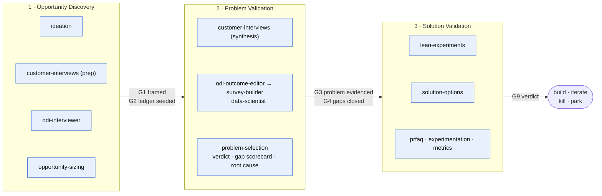
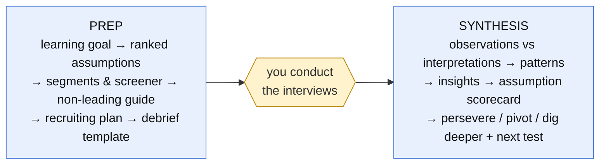
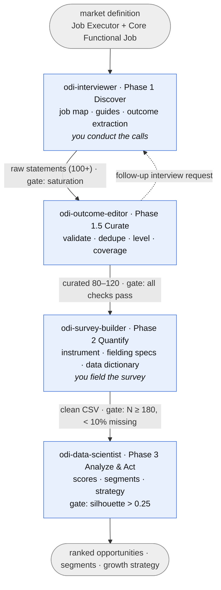
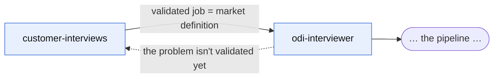
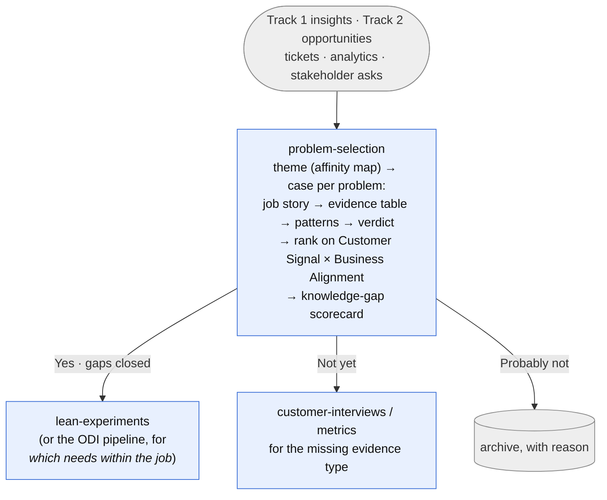
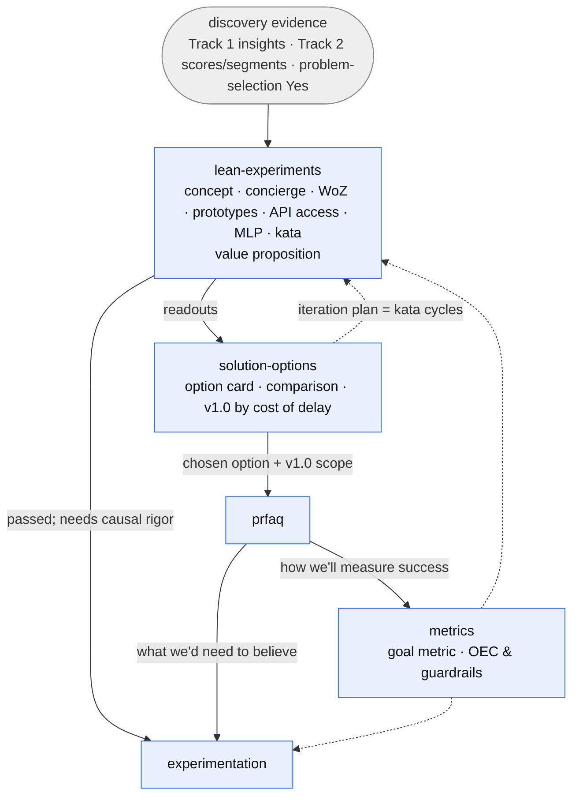

# How the System Works

The architecture of ProductExpert: what the pieces are, how an agent run
actually happens, and how the agents compose into pipelines.

## The pieces

```
ProductExpert/
├── .claude/skills/navigate/SKILL.md # FRONT DOOR — /navigate start|status|next|list
├── .claude/skills/evaluate/SKILL.md # EVALS — /evaluate routing|gates|output|all
├── evals/                           # routing cases · gate fixtures · output rubric · runs log
├── templates/initiative/            # scaffold: STATUS.md · ledger.md
├── initiatives/<slug>/              # YOUR WORK — one folder per initiative (not in the toolkit)
├── .claude/agents/                  # BEHAVIOR — one file per agent
│   ├── ideation.md                  #   front-door brainstorming partner
│   ├── opportunity-sizing.md        #   TAM/SAM/SOM both ways; register, Monte Carlo model, tests
│   ├── customer-interviews.md       #   qualitative discovery coach
│   ├── odi-interviewer.md           #   ODI Phase 1: discover
│   ├── odi-outcome-editor.md        #   ODI Phase 1.5: curate
│   ├── odi-survey-builder.md        #   ODI Phase 2: quantify
│   ├── odi-data-scientist.md        #   ODI Phase 3: analyze & act
│   ├── problem-selection.md         #   which problem, on what evidence
│   ├── lean-experiments.md          #   pre-build tests, product kata, value props
│   ├── solution-options.md          #   option cards; v1.0 minimum feature set (cost of delay)
│   ├── prfaq.md                     #   Working Backwards PR/FAQ coach
│   ├── experimentation.md           #   A/B test design & readout
│   └── metrics.md                   #   North Star trees, OMTM, tracking plans
├── methods/                         # KNOWLEDGE — what the agents read
│   ├── ideation/
│   │   ├── brainstorming.md         #   modes, rhythm, scan protocol
│   │   └── materials/               #   product-brainstorming skill (verbatim)
│   ├── customer-interviews/
│   │   ├── talking-to-humans.md     #   method + templates
│   │   ├── research-and-insight.md  #   effective research & good insight
│   │   ├── assumption-ledger.md     #   shared assumption-ledger template
│   │   └── materials/               #   third-party source materials
│   ├── odi/
│   │   ├── process-map.md           #   the pipeline spec (phases, steps, gates)
│   │   ├── outcome-statements.md    #   canonical statement grammar & rules
│   │   ├── interviewing.md          #   interview protocols (incl. partner mode)
│   │   ├── survey-design.md         #   instrument, sizing, dataset standards
│   │   └── opportunity-analysis.md  #   scoring, segmentation, strategy
│   ├── jtbd/
│   │   ├── job-stories.md           #   job-story framing; user-story rewrites
│   │   ├── requirements-are-hypotheses.md # de-requirement intake protocol
│   │   ├── value-proposition.md     #   functional+emotional jobs → statement; Strategyzer canvas
│   │   ├── segmentation.md          #   define by behaviour, describe by attribute; MECE; scope rule
│   │   └── materials/               #   Product Institute lesson; Strategyzer canvas (PDFs)
│   ├── lean-experiments/
│   │   ├── pre-build-experiments.md #   chooser, generative/evaluative, catalogue, card
│   │   ├── riskiest-assumption.md   #   feature request → 8 questions → chain → riskiest link
│   │   ├── minimum-viable-product.md #  MVP = fastest path to insight; failure modes; MVP card
│   │   ├── solution-options.md      #   the option card (11 fields), comparison, gates
│   │   ├── minimum-feature-set.md   #   v1.0 ≠ MVP; feature classes; cost of delay & CD3
│   │   ├── product-kata.md          #   Toyota Kata → Product Kata; record template
│   │   └── materials/               #   Kromer, Perri, Matts, BofA case, Gusto podcast
│   ├── problem-selection/
│   │   ├── picking-the-right-problem.md # criteria, goal readings, 4-step case, ranking
│   │   ├── knowledge-gaps.md        #   five-area scorecard; moves; exit gate to solutions
│   │   ├── root-cause-analysis.md   #   5 Whys, fishbone, interrelationship digraph
│   │   ├── affinity-mapping.md      #   K-J method, text-mode protocol (shared)
│   │   └── materials/               #   ASQ affinity-diagram page (verbatim)
│   ├── strategy/
│   │   ├── product-strategy.md      #   strategy as a deployable framework; gaps; four levels; the kata at every level
│   │   └── materials/               #   Rother's Improvement Kata & Coaching Kata pages, the five-question card
│   ├── sizing/
│   │   ├── market-sizing.md         #   TAM/SAM/SOM by exclusion; bottom-up build; top-down tree; reconcile; tests; register
│   │   └── materials/               #   Gurley, Damodaran, a16z, Pear, Janz, StrategyCase, Stanford Biodesign, Blank
│   ├── prfaq/
│   │   └── working-backwards.md     #   PR structure, FAQ banks, process
│   ├── experimentation/
│   │   └── trustworthy-experiments.md # design, trust checks, decisions
│   └── metrics/
│       ├── north-star.md            #   NSM, metric trees, tracking plans
│       └── lean-analytics.md        #   good metrics, OMTM, stages, cohorts
├── docs/                            # THIS documentation
│   ├── principles.md                #   the ideas the system runs on
│   ├── how-it-works.md              #   (this file)
│   ├── user-guide.md                #   how to drive it
│   └── interaction-model.md         #   folder layout, STATUS.md, the ten gates, /navigate
├── README.md                        # map & quick start
└── CREDITS.md                       # attribution (master list)
```

Two kinds of file matter:

- **Agent files** (`.claude/agents/*.md`) — a YAML frontmatter
  (`name`, `description`, `tools`, `model`) plus a behavior prompt: role,
  non-negotiables, input gates, process, deliverables, handoffs. Claude Code
  discovers these automatically and offers them as subagents.
- **Method docs** (`methods/`) — the knowledge: protocols, grammars,
  templates, worked examples, checklists. Authored once, read by every agent
  that needs them.

The contract between the two: **every agent's first instruction is to read
its method docs.** Behavior files stay thin (~100 lines); knowledge lives
where it can be shared, versioned, and corrected in one place.

## Where the work lives

Every agent reads and writes one place: `initiatives/<slug>/`, with
`STATUS.md` (phase, the ten gates, a log the agents append to) and
`ledger.md` (the one assumption ledger) at its root and a subfolder per
phase. `/navigate` is the front door: it scaffolds the folder, routes the
first input, and — because agents can't invoke each other but the main
session can — derives where an initiative stands from its artifacts and
names the next agent. Gates are marked by the agent whose artifact meets
the rule and re-derived by the navigator; nobody marks one by hand. Full
layout, gate rules and verbs:
[`interaction-model.md`](./interaction-model.md).

## Which agent patterns this is — and which it isn't

In the vocabulary of Anthropic's *Building Effective Agents*, this
system is a **workflow**, not an autonomous agent: the paths are
predefined and the model directs the work only *within* a step. Naming
the patterns keeps the next contributor from adding the wrong kind of
machinery.

| Pattern | Where it is here |
|---------|------------------|
| **Routing** | The `navigate` skill and each agent's `description`: classify the PM's input, hand it to a specialist |
| **Prompt chaining** with programmatic checkpoints | The phase chain; the ten gates in `STATUS.md` are the checkpoints, derived from artifacts rather than asserted |
| **Evaluator-optimizer** | Every loop where one agent returns work to another with a specific ask: outcome-editor → interviewer, problem-selection *Not yet* → discovery, prfaq's and solution-options' critique modes, the navigator flagging a gate the artifacts don't back |
| **Parallelization** (sectioning / voting) | One place only: independent affinity-sort passes for large ticket piles, reconciled afterwards (`methods/problem-selection/affinity-mapping.md` §2b) |
| **Orchestrator-workers** | **Deliberately absent.** The research-system post shows it pays for parallelizable work with little interdependence and costs ~15× a chat's tokens; a PM pipeline is sequential, interdependent, and has a human step between most stages. The navigator routes and delegates one engagement at a time; it never runs the pipeline |
| **Autonomous agent** | Absent, by the humans-in-the-loop principle: interviews, fielding, experiments and decisions are yours, so no agent can own a task end to end |

Three other lessons from the same sources are structural here: agents
**store work in files and pass references** (the initiative folder and
the status log, not the conversation); every hand-off is a **delegation
brief** with objective, inputs, outputs, gate, boundaries and effort; and
the system carries its own **evaluations** (`evals/`) — small, fixed,
rubric-judged, with a human pass. The agent-computer-interface advice
(document tools like a junior developer's docstrings; make the wrong
call hard to make) shows up as routing-rich descriptions with explicit
"not for" clauses, and as canonical absolute paths so no agent guesses
where things go.

## How a request becomes an agent run

1. **Routing.** You either name an agent explicitly ("use the odi-interviewer
   to…") or just describe your task — Claude matches it against each agent's
   `description`. Descriptions carry trigger vocabulary ("job map", "outcome
   statements", "synthesize interview notes") *and* disambiguation pointers
   ("for open-ended early discovery use customer-interviews instead"), so
   adjacent requests land on the right specialist. `/agents` lists and
   manages them.
2. **Grounding.** The agent reads its method docs first. If a doc is missing
   it falls back to the principles embedded in its own prompt — degraded but
   functional.
3. **Gating.** Before doing the work, the agent checks its input gate (e.g.
   the survey builder verifies it has *curated* statements with a coverage
   report; the data scientist verifies N ≥ 180 and < 10% missing). Failing
   input goes back upstream with a specific request — that's a feature, not
   an error. One gate is universal: nothing the agent itself generated
   counts as customer evidence (BACKGROUND at most) — the structural
   guard against the AI-era Product Death Cycle (`principles.md` §29).
4. **Working.** The agent produces its deliverables in the formats its
   method doc defines, saving artifacts as files in your working folder
   (guides, statement sets, instruments, scripts, plots) so the next stage
   can pick them up.
5. **Handing off.** The agent ends by naming what's next: which agent takes
   this output, and what gate that agent will apply — and it appends a
   log line to `STATUS.md`, marking its gate if the artifact earns it.

## The three phases

Every agent serves one of three phases — **Opportunity Discovery**
(what's worth a look?), **Problem Validation** (real? for whom? which one
first?), **Solution Validation** (does *this* solve it, cheaply, and what
do we commit to?) — and the gates on the arrows are the boundaries
between them (G1–G10 are defined in
[`interaction-model.md`](./interaction-model.md)):



The third phase is where "we heard what they asked for and built it"
gets caught: a validated problem still has to have its *solution*
falsified cheaply (concierge, Wizard of Oz, concept test, a lovable
slice) before the PR/FAQ commits to it and an A/B test measures it.

## The two method families — and the bridge

### Track 1 — Qualitative discovery (`ideation` → `customer-interviews`)

For when the riskiest thing is the idea itself. The front door is
**`ideation`** — a conversational thinking partner for the stage before
interview time is justified: frame → diverge → provoke → converge →
capture, with a short landscape scan recorded as **BACKGROUND-tier**
knowledge (per the CONFIRMED/INFERRED/BACKGROUND tiering — a scan gives
context, never a verdict; only interviews validate a problem) and a ranked
**assumption ledger** as the handoff object. Then `customer-interviews`
takes the ledger forward, with two modes:



### Track 2 — The ODI pipeline (four agents)

For when the job is validated and the question is *which needs to
prioritize*. Four agents in series, with one feedback loop and two
human-in-the-loop steps:



Full step-by-step detail (the 12 steps, gate table): see
[`../methods/odi/process-map.md`](../methods/odi/process-map.md).

### The bridge between tracks

The qualitative track's *persevere* decision produces a validated,
solution-agnostic job — which is, verbatim, the **market definition** the ODI
pipeline requires as its first input. The handoff is wired into both sides:
`customer-interviews` recommends it at synthesis time, and `odi-interviewer`
refuses to start without it (and points back to `customer-interviews` when
the job itself is still in question).



### The selection gate

Discovery produces more problems than a roadmap can hold, and not all of
them arrive through the tracks — tickets, funnels, sales notes and
stakeholder theories all nominate problems. **`problem-selection`** is the
gate between "we know about these problems" and "we're writing the PR/FAQ
for this one":



Its gates: no solution-noun in a problem statement; no *Yes* from a single
evidence type; no Business Alignment score without a stated goal (that's
`metrics`'s job). Its verdicts route: *Yes* forward, *Not yet* back to
the discovery agent that owns the missing evidence type, *Probably not*
to an archive that records why.

A *Yes* then passes the **knowledge-gap scorecard** before anyone
generates options: confidence 1–5, evidence-cited, in problem definition,
user behavior, competitive landscape, technical constraints and business
impact. The lowest area picks the move — customer interviews, root-cause
analysis (run by `problem-selection`), a competitive teardown (run by
`ideation`), a feasibility spike, or sizing with `metrics` — and Problem
Validation exits only with no area below 3.

### The solution-validation layer

Five agents sit around both tracks and consume their evidence:



- **lean-experiments** proves the solution before anything is built —
  the cheapest experiment that could say no, gated on problem evidence
  and a written value proposition; iterates in Product Kata cycles, the
  current obstacle picking the test.
- **solution-options** writes what the team now believes it should
  build as an option card (refusing any without a solution readout),
  compares options, and cuts the chosen one to a v1.0 minimum feature
  set by cost of delay — the deferred list, with costs, is the roadmap's
  input.

- **prfaq** writes the product vision *backwards* from the customer, citing
  discovery artifacts as its evidence base; its hardest open beliefs become
  test hypotheses.
- **metrics** owns what's worth measuring — the North Star tree and
  counter-metrics — which the other two inherit (success metrics for the
  PR/FAQ; OEC and guardrails for experiments).
- **experimentation** turns beliefs into pre-registered, trust-checked A/B
  tests and feeds validated learning back to the documents and decisions
  that spawned them.

## Where knowledge lives (single source of truth)

Knowledge shared by several agents is written exactly once:

| Topic | Canonical file | Read by |
|-------|---------------|---------|
| Outcome-statement grammar, validity, editing rules | `methods/odi/outcome-statements.md` | all four ODI agents |
| Pipeline phases, steps, handoff gates | `methods/odi/process-map.md` | all four ODI agents |
| Interview protocols (classic, multi-call, partner, developer banks) | `methods/odi/interviewing.md` | odi-interviewer |
| Survey instrument, sizing, score conversion, dataset standards | `methods/odi/survey-design.md` | odi-survey-builder, odi-data-scientist |
| Opportunity algorithm, segmentation, strategy | `methods/odi/opportunity-analysis.md` | odi-data-scientist |
| Qualitative interview method & templates | `methods/customer-interviews/talking-to-humans.md` | customer-interviews |
| Effective-research principles & insight quality bar | `methods/customer-interviews/research-and-insight.md` | customer-interviews |
| PR/FAQ structure, FAQ banks, working-backwards process | `methods/prfaq/working-backwards.md` | prfaq |
| Experiment design, trust checks, decision framework | `methods/experimentation/trustworthy-experiments.md` | experimentation |
| North Star framework, metric trees, tracking plans | `methods/metrics/north-star.md` | metrics, experimentation |
| Good-metric tests, OMTM, stages, archetypes, cohorts | `methods/metrics/lean-analytics.md` | metrics |
| Job-story framing (needs vs. features; user-story rewrites) | `methods/jtbd/job-stories.md` | customer-interviews, odi-interviewer, prfaq |
| Value proposition (functional + emotional jobs → statement; Strategyzer canvas; fit) | `methods/jtbd/value-proposition.md` | lean-experiments, prfaq, odi-interviewer |
| Pre-build experiments (chooser, generative/evaluative, catalogue, MVP/MLP/MVI, card) | `methods/lean-experiments/pre-build-experiments.md` | lean-experiments, experimentation (triage) |
| Product Kata (rhythm, coaching questions and reflection, record template) | `methods/lean-experiments/product-kata.md` | lean-experiments |
| Product strategy (deployable framework, three gaps, vision → intents → initiatives → options, the four-step kata at every level, strategy stack, direction ladder) | `methods/strategy/product-strategy.md` | lean-experiments, ideation, problem-selection, metrics, solution-options, prfaq, navigate |
| Market sizing (TAM/SAM/SOM by exclusion, market type, bottom-up build from the source stack, top-down tree, reconciliation, possible/plausible/probable tiers, falsifiability tests, register and Monte Carlo, diffusion) | `methods/sizing/market-sizing.md` | opportunity-sizing, problem-selection (business-impact area), prfaq (TAM FAQ), metrics (share touched) |
| Feature-request breakdown (eight assumption questions, chain, riskiest link, null-result rule) | `methods/lean-experiments/riskiest-assumption.md` | lean-experiments, ideation, prfaq |
| MVP as learning vehicle (canon, failure modes, alignment questions, maxims, MVP card) | `methods/lean-experiments/minimum-viable-product.md` | lean-experiments, solution-options |
| Option card (11 fields, tells, comparison, gates) | `methods/lean-experiments/solution-options.md` | solution-options, prfaq |
| Minimum feature set (v1.0 ≠ MVP, feature classes, cost of delay, CD3, postponement rules) | `methods/lean-experiments/minimum-feature-set.md` | solution-options |
| Requirement intake (constraint / theory / hypothesis) | `methods/jtbd/requirements-are-hypotheses.md` | customer-interviews, odi-interviewer, prfaq |
| Segmentation (three rules, MECE, define by behaviour / describe by attribute, scope rule, attribute test) | `methods/jtbd/segmentation.md` | customer-interviews, metrics, odi-data-scientist, problem-selection, ideation |
| Brainstorming modes, divergence rules, landscape-scan protocol | `methods/ideation/brainstorming.md` | ideation |
| Assumption-ledger template (categories, tiers, ranking, lifecycle) | `methods/customer-interviews/assumption-ledger.md` | ideation, customer-interviews, problem-selection, prfaq, experimentation |
| Problem-selection criteria, goal readings, evidence table, verdicts, ranking | `methods/problem-selection/picking-the-right-problem.md` | problem-selection |
| Knowledge-gap scorecard (five areas, moves, exit criteria) | `methods/problem-selection/knowledge-gaps.md` | problem-selection, ideation, customer-interviews |
| Root-cause analysis (5 Whys, fishbone, interrelationship digraph) | `methods/problem-selection/root-cause-analysis.md` | problem-selection |
| Affinity mapping (K-J): process, text-mode protocol, output template | `methods/problem-selection/affinity-mapping.md` | problem-selection, customer-interviews, ideation |

If a rule changes (say, the abstraction guide for statements), it changes in
one file and every agent inherits it on its next run.

## Extending the system

The recipe for a new agent (also in the README):

1. **Distill the knowledge** → `methods/<topic>/<source>.md`, with templates
   and checklists; raw third-party materials under
   `methods/<topic>/materials/`.
2. **Define the behavior** → `.claude/agents/<name>.md`: frontmatter with a
   routing-rich `description` (trigger words + scope + pointers to
   neighboring agents), a "read your method docs first" instruction,
   non-negotiables, gates, deliverables, handoffs.
3. **Wire the neighbors** — if it composes with existing agents, add the
   handoff in both directions (body *and* descriptions).
4. **Attribute** — cite sources inline and in `CREDITS.md`.
5. **List it** in the README's Agents section.

Design conventions to keep: agents stay thin; shared knowledge gets one
canonical file; gates are explicit; humans keep the in-the-room work; the
`description` is the router. After editing a description, a gate rule or
a method doc, run `/evaluate` (`evals/README.md`): a routing case or a
gate fixture that breaks is a bug in the change, not in the case.
